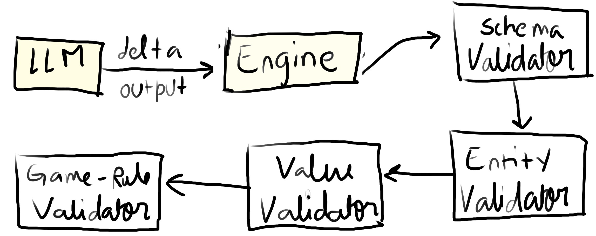

A structured, LLM-assisted RPG world engine.

---


Omnia is an experimental engine designed around a principle of separation of world simulation, game logic and language generation into distinct layers.

The goal here si to create persistant and scalable narrive worlds and not to rely on blown up prompts and let the LLM "hallucinate" game state.

## How

### 1. The world exists outside the LLM

All world data including characters, locations, items and the global timeline is stored as structured documents using Pydantic models.
The LLM does not hold or *remember* the world. So this makes sure the output is consistent and scalable.

### 2. Engine logic is deterministic

LLMs do not control movement, combat, item use, perception, or world updates. Validation is done by game engine algorithms and then the actions such as reachability checks, env constraints, time progression, etc are applied.

### 3. Dynamically Built Context

Instead of passing entire character histories or world information to the LLM, Omnia builds a "scene context" based on relevance depending on:

- characters in the shared location
- recent globaltimeline
- character-specific memories
- tiems or locations involved
- active objectives

## Patch Merging System

The patch merging system is Omnia's mechanism for updating world state in a deterministic way based on deltas produced by the LLM. So, LLM output **never directly mutates the databse** and malformed output cannot corrupt state.

The LLM outputs structured data (`JSON` for example):

```json
{
  "intent": {
    "character": "alina",
    "action": "move",
    "target": "observatory"
  },
  "patch": {
    "characters": {
      "alina": {
        "traits": {
          "curiosity": "+0.03"
        },
        "location_id": "observatory"
      }
    }
  }
}

```

### State Validation


> _Sorry for this, it's just a rough sketch right now_


## World Tick Engine

It is the subsystem that makes the makes the world run autonomously. It is responsible for:

- Updating NPC states
- Time Advancement
- Triggering autonomous actions
- Processing cause and effect
- Running Background simulations

#### Defining a "tick"

A tick is usually scenario dependent but fundamentally a discrete unit of simulated time that are processed asynchronously. This can be set to static intervals such as `1 minute`, `5 minutes` or dynamically  based on events.

### During a tick the engine:

- #### Advances global time
  - Update `world.current_date` and `world.current_time`
  - Global Timeline Entries
  - Cooldown/timers
- #### Processes NPC Autonomy
  - Build a scene context for each actve NPC
  - Reun an _intent LLM_ do determine next move
  - Validate intent using engine
  - Update NPC Memory (observation, interation, impression)
- #### Processes Environment
  - Weather updates
  - Time of day updates
  - Resource Respawn (depending on scenario)
  - Structural decay
  - World events
- #### Quest/Goal Progression

## Simulaiton Tiering

Full intelligence for all NPCs is not computed every tick. Instead, a tiered system of simulation is implemented, similar to how LODs (Level of Detail) are used for textures in 3D games:


### Tier 0 - No Simulation

Is generally used for entities that are not in the current context. Their general metadata like location, last known state, etc are stored until a character from higher tiers mentions them.

### Tier 1 - Low Res Simulation

Applied to entities that are in the same region but not interacting or those that are not important to the context. For them, only deterministic rule logic is applied:

- State Changes (attributes, etc)
- Tasks progress
- Other timers and signals

### Tier 2 - Medium Res Simulation

Conditionally applies to entities that are relevant to nearby story beats or are in active locations. They may also be near the protagonist or participating in a major event.

These entities conditonally get LLM driven decisions usually after a fixed set of intervals (like 10 ticks) or when an event triggers them, etc.

These ticks can be stochastic, for example for 10 entities 3 are run on tick 0 4 next tick and then 3 later.

#### Asynchronous Callbacks

Since LLM API calls are not instant, if the the game loop runs at 60 FPS, an LLM call taking 200ms will de-sync the simulation. So we need to have some sort of time buffer (maybe playing an 'idle' animation while in a thinking state) until the first couple of tokens arrive.

### Tier 3 - High Res Simulation

This applies only to -

- Story critical characters
- Entities directly interacting with the user controlled character

They get the full scene context, intent generation and patch merging.

### Entity Culling

### Handoff Protocol
