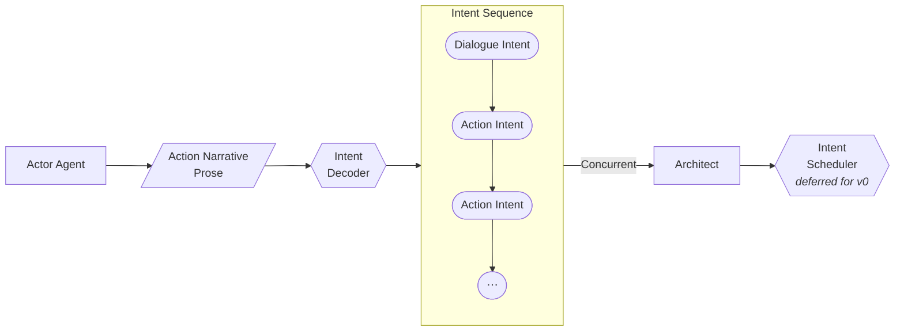

# Intents

The simple way of understanding intents is to think of it as a proposal, not an effect.

I want to do X:

- Declarative
- High-level
- Allowed to be wrong
- Cheap to generate (LLM-friendly)

But, the actor LLM doesn't directly generate an intent. In order to keep the narrative going, the actor agent simply generates the continuing prose. This keeps the tone of the story, and if the intents validate, the narrative prose will directly go to the user while the deltas generated from the intents modify the state.

Another benefit of this architecture is that we can use a separate intent decoder to detect the type of intent (Dialogue Intent or Action Intent) or even separate multiple intents in a single prose and validate them. Post-validation they can be sent to the Scheduler to allow little voids where the entity can be interjected, etc (Exact mechanism is deferred).



## Intent Decoder

The job of the Intent Decoder is to:

- See if the narrative prose can be split into multiple intents.
- Classify each intent to its type (`dialogue` or `action`).
- Parse the narrative text into structured JSON with minimal information loss.
- Contextually resolve the receiving parties/targets (for example, who is being spoken to, what object is being interacted with).

### Zod Schemas & Types

We define structured Zod schemas to validate types returned by the LLM:

- **IntentType**: `"dialogue"` | `"action"`
- **Intent**:
  - `type`: `IntentType`
  - `originalText`: `string` (the slice of raw prose text containing the intent)
  - `description`: `string` (summarized intent action)
  - `actorId`: `string`
  - `targetIds`: `string[]` (resolved recipient or target entity IDs)
- **IntentSequence**:
  - `intents`: `Intent[]`

### IntentDecoder Class

The `IntentDecoder` uses an `ILLMProvider` to query the LLM:

```typescript
export class IntentDecoder {
  constructor(private llmProvider: ILLMProvider) {}

  async decode(
    worldState: WorldState,
    actorId: string,
    narrativeProse: string,
  ): Promise<IntentSequence>;
}
```

It serializes the world state (via `worldState.serialize()`) and feeds all known entity IDs as context to the system and user prompts, enabling the model to resolve the target IDs correctly.

## A Dilemma of Concurrent Actions (deferred)

How would you deal with actions that are taking place at the same time? Since the decoder could split them into 2 different intents, and one passes the validators and the other doesn't, would it make sense to send that intent back to the actor agent? Wouldn't that create coherence issues?

If we decide to batch actions together in a single intent then how would the structure change for that?
