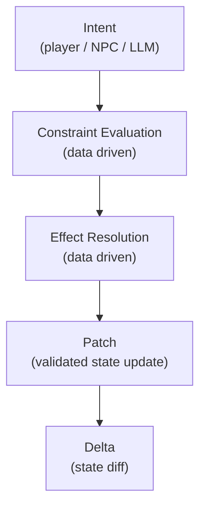

# Intents

The simple way of understanding intents is to think of it as a **proposal, not an effect.**

> I want to do X

#### For Example

- Player presses E on blackboard
- - intent: `inspect blackboard`
- NPC decides to walk
- - intent: `move to (x,y)`
- - NPC decides to weild a flamethrower
- - intent: `equip flamethrower from invenvtory`

An intent is generally:
- declarative
- high-level
- allowed to be wrong
- cheap to generate (LLM-friendly)

### Intent as a JSON

```json
{
  "actor": "player",
  "action": "inspect",
  "target": "blackboard"
}
```

The question now comes as to how one will decide if an intent is allowed or not. 

The Naive answer would be to say that *The engine does. Deterministically*

The intent '*validator*' can be thought of as a pure function:

```ts
validateIntent(intent, worldState) -> Allowed | Rejected | Modified
```

So, just by going with logic, for example scenario of objects in a classroom, the validation logic would look like this:

```ts
if (!isFacing(player, blackboard)) reject
if (worldState.flags.board_empty) reject
if (!blackboard.supports("erase")) reject
```

Now all this does make sense however as soon as I tried implementing this, I was dead in my tracks.

> If Omnia required people to handwrite validation logic like `if (!isFacing(player, blackboard)) reject` for every interaction then it would literally violate the first premise of this project.

Which is why there's a need for us to work in constraint sytem terms.

[Here's a tweet that really summed this up](https://x.com/sortedcord/status/2021206112083771862)

The checks mentioned above should not even exist as handwritten code paths, instead they should be derived from declarative constraints.

```json
{
  "intent": "erase",
  "requires": [
    { "type": "facing", "target": "self" },
    { "type": "flag", "key": "board_empty", "value": false }
  ],
  "effects": [
    { "type": "set_flag", "key": "board_empty", "value": true }
  ]
}
```

Intents need to generate like so (or a stronger format)

## Allowing (or disallowing) Intents

As mentioned previously, intents are desires. A player generates an intent to levitate a building and unless he has a trait that enables him to do this, our game engine shouldn't allow for that to happen. 

Often times, any text based AI game can allow you to take out that secret level 999 Sword which you had hidden all this time in a level 3 dungeon and the challenge will disappear.

In order to fix this issue, we need to have a generic constraint solder inside the game engine. To save ourselves from the trouble of writing per-object or per-scenario code, we write small, finite set of constraint evaluators that do this job for us, such as:

- distance
- has_flag (or trait)
- has_item
- time_of_day
- role
- permission

With this direction of thinking, its possible to dynamically generate evaluators that discard or allow intent generation (even if it sounds like wishful thinking).



so going back to our blackboard example containig interaction metadata:

```json
{
  "id": "erase_board",
  "intent": "erase",
  "requires": [
    { "type": "facing", "target": "self" },
    { "type": "flag", "key": "board_empty", "value": false }
  ],
  "effects": [
    { "type": "set_flag", "key": "board_empty", "value": true }
  ]
}
```

The equivalent high level code which would deal with this would simple be:

```ts
evaluateConstraint(constraint, context)
applyEffect(effect, worldState)
```

which would in turn make LLM calls with the required content.