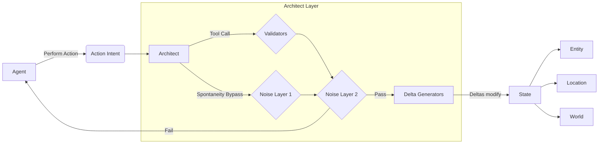

The Architect is not a specialized model, nor a special entity. It is a special context along with a set of tools given to an LLM that dictates what happens to world state.

The Architect is provided with the `WorldState`, states of entities, state of a scene, location, along with their attributes, and is asked to judge whether an action (an `Intent`) makes canonical sense. It disallows intents that break the narrative flow (for example, item ownership, entity location and state tracking).



Dialogue intents are exempted from validation and are not used for state manipulation. v0 defers atomic validators completely; instead, an umbrella LLM-based validator is used.

## Dynamic Validators (Deferred from v0)

A standard set of validators dictate if an action is possible. The Architect can dynamically generate its own validators which can be loaded and unloaded at runtime based on narration. These can be soft validators (if they fail, the intent is sent back to the entity for override confirmation).

## Noise Layers (Deferred from v0)

Since the system has complex action validation, the LLM may naturally steer towards low-stakes actions with minimal consequences, flattening the narrative. Noise layers introduce random, slightly non-sensical actions to introduce spontaneity and unexpectedness.

## Delta Generators

Delta Generators are single-responsibility components that compute discrete state updates ("deltas") from validated intents.

### How They Function

1. **Validation Prerequisite**: Execute only if validation returns `isValid: true`.
2. **Specialized Responsibility**: Each generator isolates a specific aspect of state transition (clock advancement, position updates, attribute modifications).
3. **Structured Outputs**: Generators query the LLM using Zod schemas for type-safe change deltas.
4. **Application and Persistence**: The delta is applied to the live `WorldState` by deterministic code and persisted to the database.

### Time Delta Generator

Calculates the physical time duration (in minutes) that a validated action takes to complete:

- **Inputs**: The validated action and the serialized objective `WorldState`.
- **Output (Zod Schema)**:
  ```json
  {
    "minutesToAdvance": 25,
    "explanation": "Searching a locked desk thoroughly takes time."
  }
  ```
- **Resolution**: The Architect advances `worldState.clock` by the returned minutes and saves to `SQLiteRepository`.

## A Note on Tech Debt

The Architect currently trusts an LLM's judgment about reasonable consequences rather than validating every change against declarative constraints. A general constraint solver is worth building eventually, but building it before anything is playable is foundational perfectionism that produces beautiful architecture and no game.
